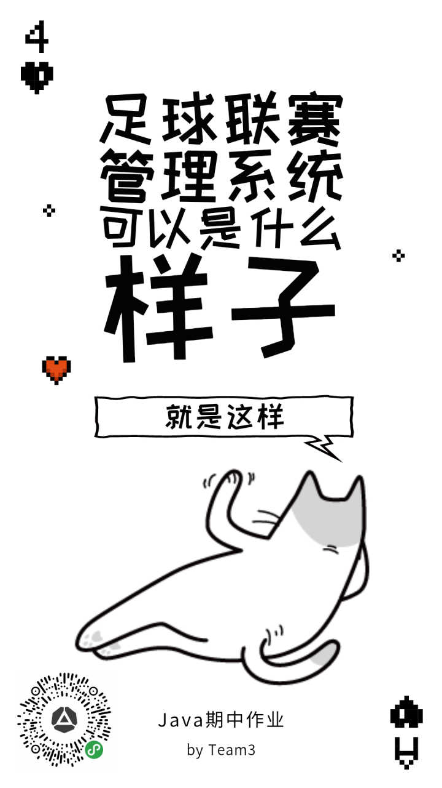

### Rate List

A Simplle Football League Management System

---
#### Technology stack

- Java
- Java Swing

We use the most popular and powerful language to build this system : a small, weak, stupid system.

And we use the most ugly GUI tool Java Swing to build the most ugly page I have never seen before..

---

_**以上均为吐槽,请勿当真,当真也行**_


 
---

#### 以下为项目开发规范

##### 基本结构:
```$xslt
.
├── Controlers
├── Models
├── Views
└── README.md

```
本项目为标准的MVC(model,view,controler)结构,
其中: 
 - Controlers 为控制层,控制数据层与视图的交互.(Controler为项目入口)
 - Views 为视图层,使用JAVA Swing编写.
 - models 数据层,数据的运算和格式化处理.
 
 ##### 接口规范:
 
 - 类应尽量解耦
 - 数据处理相关的类(比如球员类,比赛类):请提供数据读写接口.
 - 最好有单个类的测试类.
 
 ##### 最后
 由于开工时间较晚..
 
 希望我们能做完..
 
 